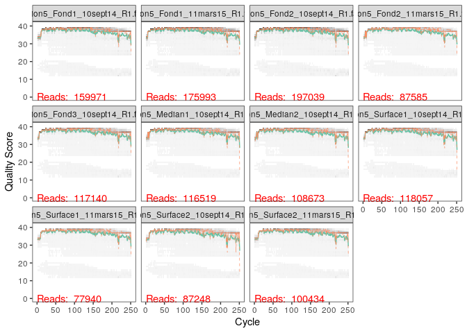
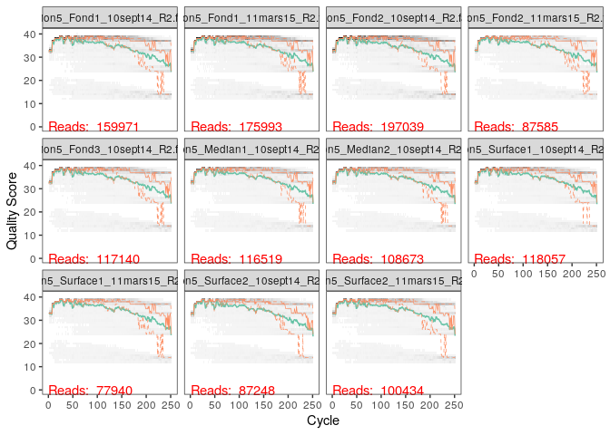
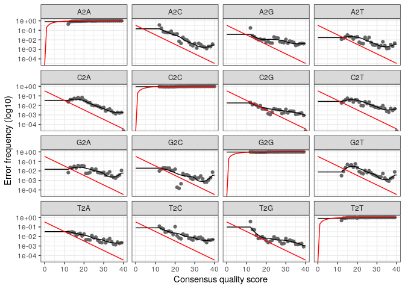

01\_cc2\_dada2
================
Irene Romero Rodríguez

  - [Préparation](#préparation)
  - [Profils de qualité](#profils-de-qualité)
  - [Trimming et filtrage des
    séquences](#trimming-et-filtrage-des-séquences)
  - [Apprentisage des erreurs.](#apprentisage-des-erreurs.)
      - [Estimation pour les R1:](#estimation-pour-les-r1)
      - [Estimation pour les R2:](#estimation-pour-les-r2)
      - [Séquences répétées.](#séquences-répétées.)
  - [Alignement des R1 et les R2 pour la création de
    contigs.](#alignement-des-r1-et-les-r2-pour-la-création-de-contigs.)
  - [Construction de la table
    d’observation](#construction-de-la-table-dobservation)
  - [Elimination des chimères.](#elimination-des-chimères.)
  - [Bilan des filtres de qualité](#bilan-des-filtres-de-qualité)
  - [Assignation taxonomique.](#assignation-taxonomique.)

# Préparation

Nous allons sur ce document traiter grâce au package de R DADA2 les
données de la rade de Brest pour ensuite pouvoir faire un analyse de
données grâce au package phyloseq. Nous avons obtenu les données grâce
au .Rmd cc2\_donnees.

``` r
dir.create("donnees")
```

    ## Warning in dir.create("donnees"): 'donnees' already exists

``` r
library(dada2)
```

    ## Loading required package: Rcpp

``` r
library(Rcpp)
library(ggplot2)
```

Nous avons crée un dossier “donnees” où l’on va déposer toutes les
données pour l’étude, celles de St\_Stratif\_10sept14 et
St\_Stratif\_11mars15. Cela va être fait sur le terminal (donc en bash)
grâce à la commande mv. Ensuite, on crée un chemin pour arriver à ce
dossier.

``` r
path <- "~/CC2_ecog2/donnees"
list.files(path)
```

    ##  [1] "filtered"                            "Station5_Fond1_10sept14_R1.fastq"   
    ##  [3] "Station5_Fond1_10sept14_R2.fastq"    "Station5_Fond1_11mars15_R1.fastq"   
    ##  [5] "Station5_Fond1_11mars15_R2.fastq"    "Station5_Fond2_10sept14_R1.fastq"   
    ##  [7] "Station5_Fond2_10sept14_R2.fastq"    "Station5_Fond2_11mars15_R1.fastq"   
    ##  [9] "Station5_Fond2_11mars15_R2.fastq"    "Station5_Fond3_10sept14_R1.fastq"   
    ## [11] "Station5_Fond3_10sept14_R2.fastq"    "Station5_Median1_10sept14_R1.fastq" 
    ## [13] "Station5_Median1_10sept14_R2.fastq"  "Station5_Median2_10sept14_R1.fastq" 
    ## [15] "Station5_Median2_10sept14_R2.fastq"  "Station5_Surface1_10sept14_R1.fastq"
    ## [17] "Station5_Surface1_10sept14_R2.fastq" "Station5_Surface1_11mars15_R1.fastq"
    ## [19] "Station5_Surface1_11mars15_R2.fastq" "Station5_Surface2_10sept14_R1.fastq"
    ## [21] "Station5_Surface2_10sept14_R2.fastq" "Station5_Surface2_11mars15_R1.fastq"
    ## [23] "Station5_Surface2_11mars15_R2.fastq"

Nous allons maintenant séparer les reads forward (R1) et reverse (R2)
sur des objets destinés à ce but.Les données ont le format
Station\_profondeur\_date\_R1.fastq (ou R2). Nous allons donc assigner
au nouveau objet la liste d’éléments trouvables à partir de path et
contenant le pattern \_R1.fastq pour les read forward et les \_R2.fastq
pour les reverse.

``` r
fnFs <- sort(list.files(path, pattern="_R1.fastq", full.names = TRUE))
fnRs <- sort(list.files(path, pattern="_R2.fastq", full.names = TRUE))

sample.names <- sapply(strsplit(basename(fnFs), "_R"), `[`, 1)
fnFs
```

    ##  [1] "/home/rstudio/CC2_ecog2/donnees/Station5_Fond1_10sept14_R1.fastq"   
    ##  [2] "/home/rstudio/CC2_ecog2/donnees/Station5_Fond1_11mars15_R1.fastq"   
    ##  [3] "/home/rstudio/CC2_ecog2/donnees/Station5_Fond2_10sept14_R1.fastq"   
    ##  [4] "/home/rstudio/CC2_ecog2/donnees/Station5_Fond2_11mars15_R1.fastq"   
    ##  [5] "/home/rstudio/CC2_ecog2/donnees/Station5_Fond3_10sept14_R1.fastq"   
    ##  [6] "/home/rstudio/CC2_ecog2/donnees/Station5_Median1_10sept14_R1.fastq" 
    ##  [7] "/home/rstudio/CC2_ecog2/donnees/Station5_Median2_10sept14_R1.fastq" 
    ##  [8] "/home/rstudio/CC2_ecog2/donnees/Station5_Surface1_10sept14_R1.fastq"
    ##  [9] "/home/rstudio/CC2_ecog2/donnees/Station5_Surface1_11mars15_R1.fastq"
    ## [10] "/home/rstudio/CC2_ecog2/donnees/Station5_Surface2_10sept14_R1.fastq"
    ## [11] "/home/rstudio/CC2_ecog2/donnees/Station5_Surface2_11mars15_R1.fastq"

``` r
sample.names
```

    ##  [1] "Station5_Fond1_10sept14"    "Station5_Fond1_11mars15"   
    ##  [3] "Station5_Fond2_10sept14"    "Station5_Fond2_11mars15"   
    ##  [5] "Station5_Fond3_10sept14"    "Station5_Median1_10sept14" 
    ##  [7] "Station5_Median2_10sept14"  "Station5_Surface1_10sept14"
    ##  [9] "Station5_Surface1_11mars15" "Station5_Surface2_10sept14"
    ## [11] "Station5_Surface2_11mars15"

# Profils de qualité

Nous allons tracer maintenant les profils de qualité de tous les
échantillons afin d’évaluer quel niveau de filtrage et de trimming il
faudra faire par la suite.

``` r
plotQualityProfile(fnFs[1:11])
```

<!-- -->

En ce qui concerne les échantillons forward, on observe que le score de
qualité est globalement bon, on voit une légère décroissance de la
qualité vers la fin de la séquence (aux alentours de 230). Cela est
logique du fait qu’avec la méthode Illumina la fin du séquençage tends à
diminuer en qualité.

``` r
plotQualityProfile(fnRs[1:11])
```

<!-- -->

Pour les séquences R2 ou reverse, on observe que le score de qualité est
bien plus bas à partir de la position 130, par rapport aux séquences
forward. Ce score de qualité plus faible diminue de façon progressive
jusqu’à la fin de la séquence. Il va donc falloir faire un trimming
important sur les séquences des R2.

# Trimming et filtrage des séquences

Nous travaillons ici avec des séquences de la région hypervariable V4V5
de l’ARN 16S. Cette région mesure environ 390pb. Maintenant on va
effectuer des “découpages” dans les read afin d’améliorer le score
global. Cependant pour obtenir la séquence finale nous allons devoir
joindre les reads et on va avoir besoin d’un chevauchement afin de
conserver la continuité de la séquence. Pour cela on doit donc tenir en
compte la taille des read et de ce que l’on va découper, mais aussi de
la taille des primers (21nt), présents sur les séquences R1.

Nous allons commencer par créer des dossiers où l’on va placer les
séquences filtrées:

``` r
filtFs <- file.path(path, "filtered", paste0(sample.names, "_F_filt.fastq.gz"))
filtRs <- file.path(path, "filtered", paste0(sample.names, "_R_filt.fastq.gz"))
names(filtFs) <- sample.names
names(filtRs) <- sample.names
sample.names
```

    ##  [1] "Station5_Fond1_10sept14"    "Station5_Fond1_11mars15"   
    ##  [3] "Station5_Fond2_10sept14"    "Station5_Fond2_11mars15"   
    ##  [5] "Station5_Fond3_10sept14"    "Station5_Median1_10sept14" 
    ##  [7] "Station5_Median2_10sept14"  "Station5_Surface1_10sept14"
    ##  [9] "Station5_Surface1_11mars15" "Station5_Surface2_10sept14"
    ## [11] "Station5_Surface2_11mars15"

Ensuite on procède à filtrer et trim les séquences. En fonction des
résultats vus sur les graphiques des scores de qualité on décide ne pas
modifier les R1 sauf pour enlever le primer. Ainsi on aura des reads de
250-21= 229 nt. Sachant qu’on a besoin, pour qu’il y ait chevauchement,
d’un total de environ 400 ou 410nt. Les séquences R2 commencent à avoir
une baisse de la qualité du score aux alentours de la position 130,
cependant la grosse diminution commence à partir de la position 15 voir
170. Si on “coupe” les séquences R2 au niveau de la position 170, nous
obtenons à la fin des séquences de 229+(170-21)= 378pb. Cependant nous
avons besoin d’une séquence légèrement longue, ainsi nous allons
sacrifier un peu de qualité sur le score de la séquence afin de pouvoir
continuer l’étude. Nous choisissons donc de couper au niveau de la
position 200.

``` r
out <- filterAndTrim(fnFs, filtFs, fnRs, filtRs, truncLen=c(250,200), trimLeft = c(21,21),
              maxN=0, maxEE=c(2,2), truncQ=2, rm.phix=TRUE,
              compress=TRUE, multithread=TRUE)

head(out)
```

    ##                                    reads.in reads.out
    ## Station5_Fond1_10sept14_R1.fastq     159971    145031
    ## Station5_Fond1_11mars15_R1.fastq     175993    159807
    ## Station5_Fond2_10sept14_R1.fastq     197039    176477
    ## Station5_Fond2_11mars15_R1.fastq      87585     79696
    ## Station5_Fond3_10sept14_R1.fastq     117140    105805
    ## Station5_Median1_10sept14_R1.fastq   116519    106244

# Apprentisage des erreurs.

La méthode leanErrors apprend du modèle d’erreur à partir des données en
alternant l’estimation des taux d’erreur et inférence (conclusion) de la
composition de l’échantillon jusqu’à ce qu’ils convergent en une
solution conjointe. L’algorithme doit partir d’une base ou tentative
initiale sur combien d’erreurs possibles il peut y avoir dans les
données utilisées. On applique cette méthode sur les reads forward puis
sur les reverse:

``` r
errF <- learnErrors(filtFs, multithread=TRUE)
```

    ## 110221135 total bases in 481315 reads from 3 samples will be used for learning the error rates.

``` r
errR <- learnErrors(filtRs, multithread=TRUE)
```

    ## 100420969 total bases in 561011 reads from 4 samples will be used for learning the error rates.

Cela nous permet d’avoir un apperçu sur l’estimation d’erreurs présent
sur nos séquences. On crée ensuite un graphique à partir de ces données
pour les reads 1 et 2 afin d’estimer sur quelle base on a plus
d’erreurs.

### Estimation pour les R1:

``` r
plotErrors(errF, nominalQ=TRUE)
```

    ## Warning: Transformation introduced infinite values in continuous y-axis
    
    ## Warning: Transformation introduced infinite values in continuous y-axis

<!-- -->

### Estimation pour les R2:

``` r
plotErrors(errR, nominalQ=TRUE)
```

    ## Warning: Transformation introduced infinite values in continuous y-axis
    
    ## Warning: Transformation introduced infinite values in continuous y-axis

<!-- -->

## Séquences répétées.

On analyse la quantité de séquences répetées dans nos données, tout
d’abord pour les R1:

``` r
dadaFs <- dada(filtFs, err=errF, multithread=TRUE)
```

    ## Sample 1 - 145031 reads in 39978 unique sequences.
    ## Sample 2 - 159807 reads in 37782 unique sequences.
    ## Sample 3 - 176477 reads in 49703 unique sequences.
    ## Sample 4 - 79696 reads in 21434 unique sequences.
    ## Sample 5 - 105805 reads in 31881 unique sequences.
    ## Sample 6 - 106244 reads in 30070 unique sequences.
    ## Sample 7 - 98411 reads in 26954 unique sequences.
    ## Sample 8 - 106995 reads in 28021 unique sequences.
    ## Sample 9 - 70842 reads in 18914 unique sequences.
    ## Sample 10 - 78294 reads in 21347 unique sequences.
    ## Sample 11 - 91238 reads in 25826 unique sequences.

Ensuite pour les R2:

``` r
dadaRs <- dada(filtRs, err=errF, multithread=TRUE)
```

    ## Sample 1 - 145031 reads in 45252 unique sequences.
    ## Sample 2 - 159807 reads in 41345 unique sequences.
    ## Sample 3 - 176477 reads in 55267 unique sequences.
    ## Sample 4 - 79696 reads in 23050 unique sequences.
    ## Sample 5 - 105805 reads in 34435 unique sequences.
    ## Sample 6 - 106244 reads in 31383 unique sequences.
    ## Sample 7 - 98411 reads in 28878 unique sequences.
    ## Sample 8 - 106995 reads in 28735 unique sequences.
    ## Sample 9 - 70842 reads in 21298 unique sequences.
    ## Sample 10 - 78294 reads in 21877 unique sequences.
    ## Sample 11 - 91238 reads in 28105 unique sequences.

Grâce à ces données on peut estimer la quantité de séquences uniques
trouvées entre les différents reads. Cependant ces séquences uniques
doivent maintenant être merged, c’est à dire, on doit trouver les R1 et
les R2 correspondants, les superposer et à partir du chevauchement entre
reads définir des contigs soit les différentes séquences permettant de
trouver d’une part l’abondance d’espèces différentes en fonction de la
variabilité; d’autre part, ça va nous permettre de faire l’assignation
taxonomique et donc identifier à quelles bactéries correspondent ces
séquences.

# Alignement des R1 et les R2 pour la création de contigs.

On va vérifier que l’on a bien le même nombre d’échantillons dans chaque
objet (dadaFs et dadaRs et leur données filtrées respectivement).

``` r
length(dadaFs)
```

    ## [1] 11

``` r
length(filtFs)
```

    ## [1] 11

``` r
length(dadaRs)
```

    ## [1] 11

``` r
length(filtRs)
```

    ## [1] 11

On a bien 11 ce qui correspond à notre nombre d’échantillons. Nous
pouvons maintenant lier nos reads et créer les contigs qui vont
permettre d’obtenir les séquences des ARN16S trouvés dans nos
échantillons.

``` r
mergers <- mergePairs(dadaFs, filtFs, dadaRs, filtRs, verbose=TRUE)
```

    ## 115267 paired-reads (in 4575 unique pairings) successfully merged out of 140299 (in 21245 pairings) input.

    ## 136253 paired-reads (in 3637 unique pairings) successfully merged out of 155541 (in 15587 pairings) input.

    ## 139552 paired-reads (in 6204 unique pairings) successfully merged out of 170438 (in 26756 pairings) input.

    ## 65981 paired-reads (in 2302 unique pairings) successfully merged out of 77361 (in 9533 pairings) input.

    ## 81835 paired-reads (in 3060 unique pairings) successfully merged out of 101396 (in 16055 pairings) input.

    ## 85669 paired-reads (in 3236 unique pairings) successfully merged out of 102683 (in 13995 pairings) input.

    ## 80015 paired-reads (in 2594 unique pairings) successfully merged out of 95100 (in 12121 pairings) input.

    ## 88613 paired-reads (in 3005 unique pairings) successfully merged out of 103787 (in 12041 pairings) input.

    ## 58623 paired-reads (in 1674 unique pairings) successfully merged out of 68461 (in 7945 pairings) input.

    ## 65565 paired-reads (in 1737 unique pairings) successfully merged out of 76322 (in 8252 pairings) input.

    ## 73100 paired-reads (in 2670 unique pairings) successfully merged out of 87828 (in 11958 pairings) input.

Les résultats nous indiquent, par exemple pour la première ligne que
l’on a réussi à chevaucher 112 267 séquences, dont 4 575 sont des
séquences uniques, à partir des 140 299 reads avec, 21 245 paires, des
données d’étude.

``` r
head(mergers[[1]])
```

    ##                                                                                                                                                                                                                                                                                                                                                                                sequence
    ## 1     TACGAAGGGACCTAGCGTAGTTCGGAATTACTGGGCTTAAAGAGTTCGTAGGTGGTTGAAAAAGTTAGTGGTGAAATCCCAGAGCTTAACTCTGGAACTGCCATTAAAACTTTTCAGCTAGAGTATGATAGAGGAAAGCAGAATTTCTAGTGTAGAGGTGAAATTCGTAGATATTAGAAAGAATACCAATTGCGAAGGCAGCTTTCTGGATCATTACTGACACTGAGGAACGAAAGCATGGGTAGCGAAGAGGATTAGATACCCTCGTAGTCCATGCCGTAAACGATGTGTGTTAGACGTTGGAAATTTATTTTCAGTGTCGCAGGGAAACCGATAAACACACCGCCTGGGGAGTACGACCGCAAGGTT
    ## 2     TACGAAGGGACCTAGCGTAGTTCGGAATTACTGGGCTTAAAGAGTTCGTAGGTGGTTGAAAAAGTTGGTGGTGAAATCCCAGAGCTTAACTCTGGAACTGCCATCAAAACTTTTCAGCTAGAGTATGATAGAGGAAAGCAGAATTTCTAGTGTAGAGGTGAAATTCGTAGATATTAGAAAGAATACCAATTGCGAAGGCAGCTTTCTGGATCATTACTGACACTGAGGAACGAAAGCATGGGTAGCGAAGAGGATTAGATACCCTCGTAGTCCATGCCGTAAACGATGTGTGTTAGACGTTGGAAATTTATTTTCAGTGTCGCAGCGAAAGCGATAAACACACCGCCTGGGGAGTACGACCGCAAGGTT
    ## 3     TACGAAGGGACCTAGCGTAGTTCGGAATTACTGGGCTTAAAGAGTTCGTAGGTGGTTGAAAAAGTTGGTGGTGAAATCCCAGAGCTTAACTCTGGAACTGCCATCAAAACTTTTCAGCTAGAGTTTGATAGAGGAAAGCAGAATTTCTAGTGTAGAGGTGAAATTCGTAGATATTAGAAAGAATACCAATTGCGAAGGCAGCTTTCTGGATCATTACTGACACTGAGGAACGAAAGCATGGGTAGCGAAGAGGATTAGATACCCTCGTAGTCCATGCCGTAAACGATGTGTGTTAGACGTTGGAAATTTATTTTCAGTGTCGCAGCGAAAGCGATAAACACACCGCCTGGGGAGTACGACCGCAAGGTT
    ## 4     TACGAAGGGACCTAGCGTAGTTCGGAATTACTGGGCTTAAAGAGTTCGTAGGTGGTTGAAAAAGTTAGTGGTGAAATCCCAGAGCTTAACTCTGGAACTGCCATTAAAACTTTTCAGCTAGAGTATGATAGAGGAAAGCAGAATTTCTAGTGTAGAGGTGAAATTCGTAGATATTAGAAAGAATACCAATTGCGAAGGCAGCTTTCTGGATCATTACTGACACTGAGGAACGAAAGCATGGGTAGCGAAGAGGATTAGATACCCTCGTAGTCCATGCCGTAAACGATGTGTGTTAGACGTTGGAAATTTATTTTCAGTGTCGCAGCGAAAGCGATAAACACACCGCCTGGGGAGTACGACCGCAAGGTT
    ## 5     TACGAAGGGACCTAGCGTAGTTCGGAATTACTGGGCTTAAAGAGTTCGTAGGTGGTTGAAAAAGTTGGTGGTGAAATCCCAGAGCTTAACTCTGGAACTGCCATCAAAACTTTTCAGCTAGAGTATGATAGAGGAAAGCAGAATTTCTAGTGTAGAGGTGAAATTCGTAGATATTAGAAAGAATACCAATTGCGAAGGCAGCTTTCTGGATCATTACTGACACTGAGGAACGAAAGCATGGGTAGCGAAGAGGATTAGATACCCTCGTAGTCCATGCCGTAAACGATGTGTGTTAGACGTTGGAAATTTATTTTCAGTGTCGCAGGGAAACCGATAAACACACCGCCTGGGGAGTACGACCGCAAGGTT
    ## 6 TACGAGGGGTCCTAGCGTTGTCCGGATTTACTGGGCGTAAAGGGTACGTAGGCGTTTTAATAAGTTGTATGTTAAATATCTTAGCTTAACTAAGAAAGTGCATACAAAACTGTTAAGATAGAGTTTGAGAGAGGAACGCAGAATTCATGGTGGAGCGGTGACATGCGTAGATATCATGAGGAAAGTCAAATGCGAAGGCAGCCTTCTGGCTCAAAACTGACGCTGAGGTACGAAAGCGTGGGGAGCGAACAGGATTAGATACCCTGGTAGTCCACGCCGTAAACGATGAGTATTTGGTGCTGGGGGATTCGACCCTTTCAGTGCCGTAGCTAACGCGATAAATACTCCGCCTGGGGACTACGATCGCAAGATT
    ##   abundance forward reverse nmatch nmismatch nindel prefer accept
    ## 1      5186       1       2     39         0      0      2   TRUE
    ## 2      4127       2       1     39         0      0      2   TRUE
    ## 3      3781       3       1     39         0      0      2   TRUE
    ## 4      2482       1       1     39         0      0      2   TRUE
    ## 5      2240       2       2     39         0      0      2   TRUE
    ## 6      2133       5       9     35         0      0      1   TRUE

Sur cet apperçu on peut voir les six premières séquences obtenues sur
l’échantillon 1. On ajoute ça sur ce script de façon illustrative,
mais on peut remarquer que ces séquences sont très similaires et
différent par très peu de nucléotides, cela pourrait montrer des
erreurs de séquençage ponctuels. On peut voir tout de même l’abondance
de ces séquences au sein de l’échantillon.

# Construction de la table d’observation

On construit et évalue les dimensions de la table d’observations des
séquences construites à partir des mergers.

``` r
seqtab <- makeSequenceTable(mergers)
dim(seqtab)
```

    ## [1]    11 17322

Nous avons obtenu une table ayant 11 colonnes (11 échantillons
correspondant aux Fond 1 et 2 de 2014 et 2015; fond 3 de 2014; median 1
et 2 de 2014 et surface 1 et 2 de 2014 et 2015). Et avec 17 322 rangées
correspondant aux différentes séquences obtenues.

On veut connaitre la taille des séquences obtenues:

``` r
table(nchar(getSequences(seqtab)))
```

    ## 
    ##  352  353  362  363  364  365  366  367  368  369  370  371  372  373  374  375 
    ##    1    1    1    1    4  197   23  161  164 4871 3129 2150 2266 2459  101 1686 
    ##  376  377  378  382  386  387  389  392 
    ##   91    5    1    1    2    1    1    5

On observe que la plupart des séquences ont une taille comprise entre
365 pb et 376 pb.

# Elimination des chimères.

La différence des tailles nous indique qu’il y a très probablement des
chimères (ce qui est normal dans du séquençage, et surtout avec un
faible chevauchement à l’heure de rassembler les fragments séquencés).
Nous devons donc les éliminer. On cherche les chimères grâce pa la
fonction removeBimeraDenovo et on les enlève de la table seqtable en
créant une table seqtab.nochim.

``` r
seqtab.nochim <- removeBimeraDenovo(seqtab, method="consensus", multithread=TRUE, verbose=TRUE)
```

    ## Identified 15796 bimeras out of 17322 input sequences.

``` r
dim(seqtab.nochim)
```

    ## [1]   11 1526

Des 17 322 séquences uniques obtenues, on a trouvé 1 526 chimères. On
étudie le taux de chimères en divisant le nombre de séquences présentes
dans la table de données sans chimères divisées par la table de données
avec chimères.

``` r
sum(seqtab.nochim)/sum(seqtab)
```

    ## [1] 0.784716

ce résultat nous dit que 78.47% de nos séquences étaient des séquences
uniques non issues de chimères (taux de chimères de 21,53%). Le taux de
chimères est lègerement en dessous de 25% donc presque 1/4 de nos
séquences étaient des chimères, cela est un taux de chimères assez
important.

# Bilan des filtres de qualité

On crée une table contenant le bilan des séquences sans filtrer;
filtrées; le nombre de mergers…

``` r
getN <- function(x) sum(getUniques(x))
track <- cbind(out, sapply(dadaFs, getN), sapply(dadaRs, getN), sapply(mergers, getN), rowSums(seqtab.nochim))

colnames(track) <- c("input", "filtered", "denoisedF", "denoisedR", "merged", "nonchim")
rownames(track) <- sample.names
head(track)
```

    ##                            input filtered denoisedF denoisedR merged nonchim
    ## Station5_Fond1_10sept14   159971   145031    142239    142849 115267   87576
    ## Station5_Fond1_11mars15   175993   159807    157275    157793 136253  110816
    ## Station5_Fond2_10sept14   197039   176477    172714    173919 139552  103290
    ## Station5_Fond2_11mars15    87585    79696     78289     78596  65981   54272
    ## Station5_Fond3_10sept14   117140   105805    103125    103854  81835   63670
    ## Station5_Median1_10sept14 116519   106244    104130    104625  85669   65312

# Assignation taxonomique.

Finalement on fait une assignation taxonomique aux séquences obtenues.
L’assignation se fait correctement cependant on ne réussi pas à faire
une assignation des espèces.

``` r
taxa <- assignTaxonomy(seqtab.nochim, "~/CC2_ecog2/silva_nr99_v138_wSpecies_train_set.fa.gz", multithread=TRUE)
taxa.print <- taxa # Removing sequence rownames for display only
rownames(taxa.print) <- NULL
head(taxa.print)
```

    ##      Kingdom    Phylum             Class                 Order            
    ## [1,] "Bacteria" "Proteobacteria"   "Alphaproteobacteria" "SAR11 clade"    
    ## [2,] "Bacteria" "Cyanobacteria"    "Cyanobacteriia"      "Synechococcales"
    ## [3,] "Bacteria" "Proteobacteria"   "Alphaproteobacteria" "SAR11 clade"    
    ## [4,] "Bacteria" "Proteobacteria"   "Alphaproteobacteria" "SAR11 clade"    
    ## [5,] "Bacteria" "Proteobacteria"   "Alphaproteobacteria" "SAR11 clade"    
    ## [6,] "Bacteria" "Actinobacteriota" "Acidimicrobiia"      "Actinomarinales"
    ##      Family             Genus                     Species
    ## [1,] "Clade I"          "Clade Ia"                NA     
    ## [2,] "Cyanobiaceae"     "Synechococcus CC9902"    NA     
    ## [3,] "Clade I"          "Clade Ia"                NA     
    ## [4,] "Clade I"          "Clade Ia"                NA     
    ## [5,] "Clade II"         NA                        NA     
    ## [6,] "Actinomarinaceae" "Candidatus Actinomarina" NA

Fin DADA2 du CC2. Suite sur 02\_cc2\_phyloseq.
