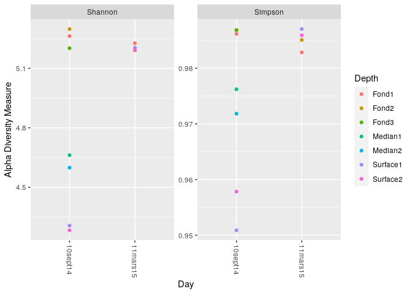
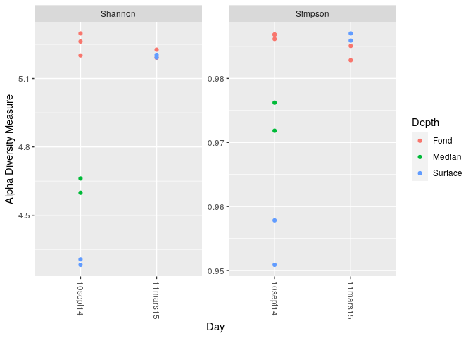
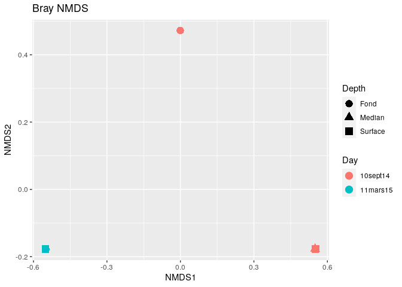
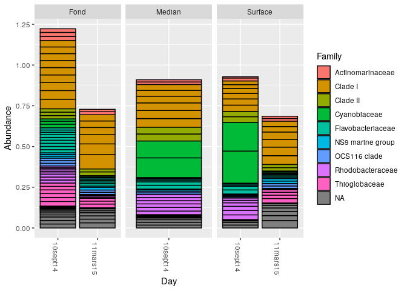
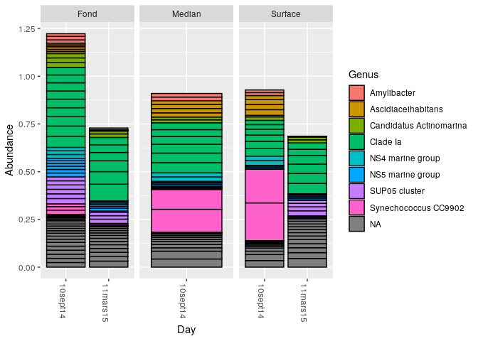
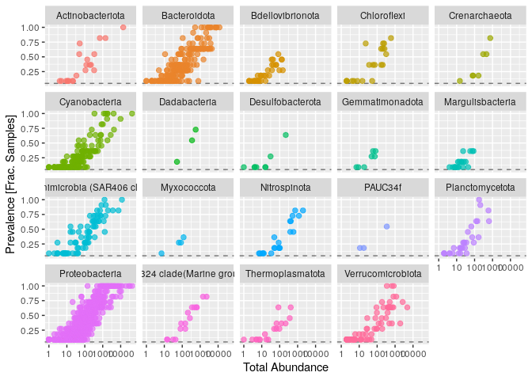
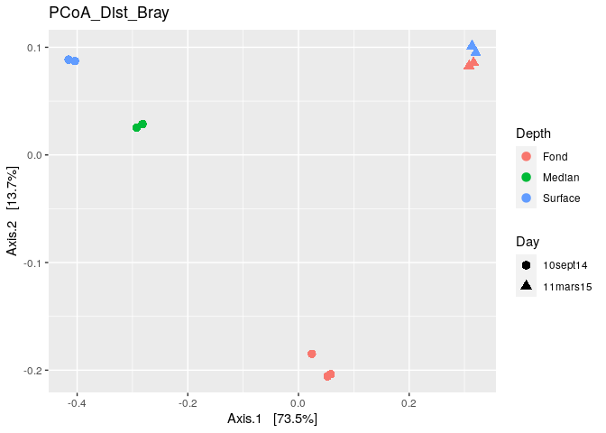

02\_cc2\_phyloseq
================
Irene Romero Rodríguez

  - [Création objet phyloseq](#création-objet-phyloseq)
  - [Alpha diversité](#alpha-diversité)
  - [Ordinations](#ordinations)
  - [Filtrage taxonomique](#filtrage-taxonomique)
  - [Prévalence](#prévalence)
  - [Analyse par PCoA](#analyse-par-pcoa)
  - [QUESTIONS](#questions)
      - [Question 1](#question-1)
      - [Question 2](#question-2)

``` r
library(rmarkdown)
library(knitr)
load("~/CC2_ecog2/envmt_dada2cc2.RData")
```

``` r
library(rmarkdown)
library(knitr)
library(phyloseq); packageVersion("phyloseq")
```

    ## [1] '1.32.0'

``` r
library(Biostrings); packageVersion("Biostrings")
```

    ## Loading required package: BiocGenerics

    ## Loading required package: parallel

    ## 
    ## Attaching package: 'BiocGenerics'

    ## The following objects are masked from 'package:parallel':
    ## 
    ##     clusterApply, clusterApplyLB, clusterCall, clusterEvalQ,
    ##     clusterExport, clusterMap, parApply, parCapply, parLapply,
    ##     parLapplyLB, parRapply, parSapply, parSapplyLB

    ## The following objects are masked from 'package:stats':
    ## 
    ##     IQR, mad, sd, var, xtabs

    ## The following objects are masked from 'package:base':
    ## 
    ##     anyDuplicated, append, as.data.frame, basename, cbind, colnames,
    ##     dirname, do.call, duplicated, eval, evalq, Filter, Find, get, grep,
    ##     grepl, intersect, is.unsorted, lapply, Map, mapply, match, mget,
    ##     order, paste, pmax, pmax.int, pmin, pmin.int, Position, rank,
    ##     rbind, Reduce, rownames, sapply, setdiff, sort, table, tapply,
    ##     union, unique, unsplit, which, which.max, which.min

    ## Loading required package: S4Vectors

    ## Loading required package: stats4

    ## 
    ## Attaching package: 'S4Vectors'

    ## The following object is masked from 'package:base':
    ## 
    ##     expand.grid

    ## Loading required package: IRanges

    ## 
    ## Attaching package: 'IRanges'

    ## The following object is masked from 'package:phyloseq':
    ## 
    ##     distance

    ## Loading required package: XVector

    ## 
    ## Attaching package: 'Biostrings'

    ## The following object is masked from 'package:base':
    ## 
    ##     strsplit

    ## [1] '2.56.0'

``` r
library(ggplot2); packageVersion("ggplot2")
```

    ## [1] '3.3.2'

``` r
library(dada2)
```

    ## Loading required package: Rcpp

``` r
library(DECIPHER)
```

    ## Loading required package: RSQLite

``` r
library(phangorn)
```

    ## Loading required package: ape

    ## 
    ## Attaching package: 'ape'

    ## The following object is masked from 'package:Biostrings':
    ## 
    ##     complement

# Création objet phyloseq

A partir des données triées sur la partie DADA2, nous allons maintenant
créer un objet phyloseq. Cet objet phyloseq va contenir une table de
données dans laquelle on peut voir les informations des séquences des
échantillons en fonction de la profondeur et du jour de
l’échantillonnage.

``` r
samples.out <- rownames(seqtab.nochim)
depth <- sapply(strsplit(samples.out, "_"), `[`, 2)
day <- sapply(strsplit(samples.out, "_"), `[`, 3)
samdf <- data.frame(Depth=depth, Day=day)
rownames(samdf) <- samples.out
```

Cet objet phyloseq on va le créer de façon à contenir une table d’OTU;
une table de données (jour et profondeur d’échantillonnage) et une table
avec l’assignation taxonomique.

``` r
ps <- phyloseq(otu_table(seqtab.nochim, taxa_are_rows=FALSE), 
               sample_data(samdf), 
               tax_table(taxa))
```

On procede maintenant à attribuer des string chains plus courtes aux
noms des dossiers afin d’avoir plus de facilité pour travailler sur des
tableaux par exemple. On veut cependant garder la séquence en entier,
pour cela on va garder la séquence sur le refseq slot de l’objet et
renommer le taxa pour un nom plus court:

``` r
dna <- Biostrings::DNAStringSet(taxa_names(ps))
names(dna) <- taxa_names(ps)
ps <- merge_phyloseq(ps, dna)
taxa_names(ps) <- paste0("ASV", seq(ntaxa(ps)))

ps
```

    ## phyloseq-class experiment-level object
    ## otu_table()   OTU Table:         [ 1526 taxa and 11 samples ]
    ## sample_data() Sample Data:       [ 11 samples by 2 sample variables ]
    ## tax_table()   Taxonomy Table:    [ 1526 taxa by 7 taxonomic ranks ]
    ## refseq()      DNAStringSet:      [ 1526 reference sequences ]

# Alpha diversité

Afin d’étudier la diversité relative aux échantillons de chaque
profondeur et de chaque jour, nous allons tracer des graphiques
permettant d’observer la richesse de chaque un des échantillons. Ce
graphique va être tracé deux fois, une fois à partir de l’indice de
Shannon et une deuxième avec l’indice de Simpson afin de pouvoir
comparer les données.

``` r
plot_richness(ps, x="Day", measures=c("Shannon", "Simpson"), color="Depth")
```

<!-- -->

Ces deux graphiques nous montrent un résultat similaire. On observe que
pour les échantillons effectués en septembre 2014 on a trois groupes
différents. En effet on constate que les échantillons en surface ont une
richesse beaucoup moins abondante que ceux trouvés en profondeur, qui
ont la richesse la plus abondante (donc plus de diversité). Les
échantillons prélévés à une profondeur moyenne se situent entre les
deux abondances. Cependant pour mars 2015 on ne retrouve qu’un seul
groupe, de façon indifférente à la profondeur d’échantillonnage,
contenant une diversité élevée et assimilable à celle retrouvée en
profondeur en septembre 2014.

On constate que peut importe l’échantillon de fond (1, 2 ou 3); moyen
(1,2) ou surface (1,2) les résultats sont similaires. Nous allons donc
regrouper tous les échantillons de fond (1 et 2) sur un groupe “fond”.
Et pareil pour les autres profondeurs.

``` r
depth<- sapply(strsplit(depth, "1"),`[`,1)
depth<- sapply(strsplit(depth, "2"),`[`,1)
depth<- sapply(strsplit(depth, "3"),`[`,1)
print (depth)
```

    ##  [1] "Fond"    "Fond"    "Fond"    "Fond"    "Fond"    "Median"  "Median" 
    ##  [8] "Surface" "Surface" "Surface" "Surface"

``` r
samdf <- data.frame(Depth=depth, Day=day)
rownames(samdf) <- samples.out

ps <- phyloseq(otu_table(seqtab.nochim, taxa_are_rows=FALSE), 
               sample_data(samdf), 
               tax_table(taxa))
plot_richness(ps, x="Day", measures=c("Shannon", "Simpson"), color="Depth")
```

<!-- -->

# Ordinations

Nous avons voulu sur cette partie essayer de créer une ordination basée
sur la distance de Bray Curtis et à partir de la méthode NMDS afin
d’essayer d’observer des éventuels groupes dépendant de la profondeur
et de la date de prélevement des échantillons. Ces groupes étant définis
par les abondances rélatives des OTUs regroupées sur l’objet phyloseq.

``` r
ordination_test <- transform_sample_counts(ps, function(otu) otu/sum(otu))
ord.nmds.bray <- ordinate(ordination_test, method="NMDS", distance="bray")
```

    ## Run 0 stress 0.0008103361 
    ## Run 1 stress 9.686126e-05 
    ## ... New best solution
    ## ... Procrustes: rmse 0.03700636  max resid 0.05101756 
    ## Run 2 stress 0.001653898 
    ## Run 3 stress 0.1372051 
    ## Run 4 stress 0.1372051 
    ## Run 5 stress 0.001189701 
    ## Run 6 stress 0.002450142 
    ## Run 7 stress 0.003266569 
    ## Run 8 stress 0.1372051 
    ## Run 9 stress 0.0001179969 
    ## ... Procrustes: rmse 0.02306878  max resid 0.03053344 
    ## Run 10 stress 0.003109437 
    ## Run 11 stress 9.893808e-05 
    ## ... Procrustes: rmse 0.003945201  max resid 0.005536158 
    ## ... Similar to previous best
    ## Run 12 stress 9.925465e-05 
    ## ... Procrustes: rmse 0.1480832  max resid 0.2417037 
    ## Run 13 stress 0.0003663002 
    ## ... Procrustes: rmse 0.008049406  max resid 0.011236 
    ## Run 14 stress 0.0001328897 
    ## ... Procrustes: rmse 0.00392616  max resid 0.005510301 
    ## ... Similar to previous best
    ## Run 15 stress 0.002268627 
    ## Run 16 stress 0.002611465 
    ## Run 17 stress 9.847492e-05 
    ## ... Procrustes: rmse 0.1549939  max resid 0.2532718 
    ## Run 18 stress 0.1372051 
    ## Run 19 stress 0.001540472 
    ## Run 20 stress 0.003451749 
    ## *** Solution reached

    ## Warning in metaMDS(veganifyOTU(physeq), distance, ...): stress is (nearly) zero:
    ## you may have insufficient data

``` r
plot_ordination(ordination_test, ord.nmds.bray, color="Day", shape="Depth", title="Bray NMDS") + geom_point(size=4)
```

<!-- -->

Le fait de travailler avec peu d’échantillons n’a pas permis de tracer
une ordination par la méthode NMDS très effective… Cependant on peut
observer qu’au sein des échantillons de mars on confirme ne retrouver
qu’un seul groupe, alors que pour les données de septembre 2014 il
semblerait avoir des sous groupes distincts.

On trace par la suite des histogrammes permettant de voir l’abondance
des 20 familles et des 20 genres les plus abondants au sein des
échantillons en fonction de la profondeur d’échantillonnage et pour
chaque une des deux dates d’échantillonnage. Cela permet de voir encore
une fois l’alpha diversité de nos échantillons mais nous permet tout de
même de comparer un peu les possibles différences présentes au sein de
l’échantillon afin d’essayer de déterminer des possibles marqueurs
biologiques. Nous aurions pu le faire avec les espèces afin de trouver
des biomarqueurs expliquant la différence cependant l’assignation
d’espèces ne donnait pas beaucoup d’informations.

``` r
library(gridExtra)
```

    ## 
    ## Attaching package: 'gridExtra'

    ## The following object is masked from 'package:BiocGenerics':
    ## 
    ##     combine

``` r
top20 <- names(sort(taxa_sums(ps), decreasing=TRUE))[1:20]
ps.top20 <- transform_sample_counts(ps, function(OTU) OTU/sum(OTU))
ps.top20 <- prune_taxa(top20, ps.top20)
Genusplot <- plot_bar(ps.top20, x="Day", fill="Genus") + facet_wrap(~Depth, scales="free_x")
Familyplot <- plot_bar(ps.top20, x="Day", fill="Family") + facet_wrap(~Depth, scales="free_x")
print (Familyplot)
```

<!-- -->

En ce qui concerne les familles on constate tout d’abord que pour les
prélévements de septembre 2014 on observe une présence importante de
Cyanobiaceae qui n’est pas présente dans les échantillons de mars 2015.
D’autre par on constate de même la présence de la famille des
Rhodobacteraceae dans ces mêmes échantillons et leur absence au sein des
échantillons de mars 2015. Cependant au sein des échantillons de
septembre 2014 on constate tout de même que ces deux familles sont
présentes et de façon abondante dans les profondeurs “surface” et
“median” qui sont les deux profondeurs ayant moins de diversité en
septembre et les plus distinctes de la surface. Autres que ces deux
présences/absences majeures on dirait qu’au sein des familles la
repartition est similaire avec peut être une présence légérement
supérieure au sein des bactéries de la Clade I et des Actinomarinaceae
dans les échantillons du fond.

D’autre part, les bactéries de la famille des Cyanobiaceae sont des
bactéries similaires aux algues a propriétés photosynthétiques et
colonisant la surface marine dans les mois chauds de l’année. Les
bactéries Rhodobacteraceae sont des Protéobactéries, étant constitués
des alphaprotéobactéries; bétaprotéobactéries et gammaprotéobactéries.
Dont des bactéries pourpres(phototrophes).

Comme on n’a pas réussi à assigner les espèces correctement à nos
séquences nous allons faire une étude allant jusqu’au genre bactérien
afin de voir d’autres possibles différences.

``` r
print(Genusplot)
```

<!-- -->

On constate ici que les genres le plus abondant sont les bactéries des
Clade Ia (Alphaprotéobactéries) des protéobactéries. Les différences
observées en septembre sont issues de l’absence de SUP05
(Gammaprotéobactéries) et présence abondante des synechococcus CC9902
(Cyanobacteria) et Ascidiaceihabitans (Alphaprotéobactérie).

Les alpha-protéobactéries étant des microorganismes majeurement
phototrophes. Et les cyanobactéries étant phototrophes et oxygéniques
(ce qui explique une abondance plutôt en surface). La très légère
présence en profondeur n’est vue que en septrembre, ce qui pourrait
indiquer qu ces échantillons correspondent à de l’ARN prélévé de
cellules mortes ayant pu couler vers le fond marin.

# Filtrage taxonomique

Nous avons tout de même observé une quantité non négligéable de familles
non caractérisées. Afin de filtrer nos données d’éventuels erreurs de
séquençage nous allons étudier l’abondance au sein des phylums.

``` r
rank_names(ps)
```

    ## [1] "Kingdom" "Phylum"  "Class"   "Order"   "Family"  "Genus"   "Species"

``` r
table(tax_table(ps)[, "Phylum"], exclude = NULL)
```

    ## 
    ##              Actinobacteriota                  Bacteroidota 
    ##                            21                           230 
    ##              Bdellovibrionota              Campilobacterota 
    ##                            34                             1 
    ##                   Chloroflexi                 Crenarchaeota 
    ##                            21                             7 
    ##                 Cyanobacteria                  Dadabacteria 
    ##                           147                             3 
    ##                  Dependentiae              Desulfobacterota 
    ##                             1                             8 
    ##               Elusimicrobiota                Fibrobacterota 
    ##                             1                             2 
    ##                    Firmicutes               Gemmatimonadota 
    ##                             1                             7 
    ##               Hydrogenedentes              Margulisbacteria 
    ##                             1                            20 
    ## Marinimicrobia (SAR406 clade)                   Myxococcota 
    ##                            77                             4 
    ##                         NB1-j                  Nitrospinota 
    ##                             2                            21 
    ##                       PAUC34f               Planctomycetota 
    ##                             3                            30 
    ##                Proteobacteria  SAR324 clade(Marine group B) 
    ##                           767                            16 
    ##              Thermoplasmatota             Verrucomicrobiota 
    ##                            18                            71 
    ##                          <NA> 
    ##                            12

Grâce à ces observatios on constate 12 phylums non caractérisés, cela
étant peu probable on élimine ces séquences de notre objet phyloseq.

``` r
ps <- subset_taxa(ps, !is.na(Phylum) & !Phylum %in% c("", "uncharacterized"))
```

# Prévalence

On souhaite maintenant effectuer une étude de prévalence et tout de même
trier nos séquences par rapport à des éventuels erreurs de séquençage.
On construit donc une table permettant l’étude de la prévalence en
fonction des OTU présentes dans la table d’OTU de l’objet phyloseq
contenant nos données. Cet étude va être effectué avec les phylum
présents.

``` r
prevdf = apply(X = otu_table(ps),
               MARGIN = ifelse(taxa_are_rows(ps), yes = 1, no = 2),
               FUN = function(x){sum(x > 0)})
# Add taxonomy and total read counts to this data.frame
prevdf = data.frame(Prevalence = prevdf,
                    TotalAbundance = taxa_sums(ps),
                    tax_table(ps))
plyr::ddply(prevdf, "Phylum", function(df1){cbind(mean(df1$Prevalence),sum(df1$Prevalence))})
```

    ##                           Phylum        1    2
    ## 1               Actinobacteriota 3.904762   82
    ## 2                   Bacteroidota 4.091304  941
    ## 3               Bdellovibrionota 2.382353   81
    ## 4               Campilobacterota 2.000000    2
    ## 5                    Chloroflexi 4.190476   88
    ## 6                  Crenarchaeota 4.000000   28
    ## 7                  Cyanobacteria 3.170068  466
    ## 8                   Dadabacteria 5.333333   16
    ## 9                   Dependentiae 1.000000    1
    ## 10              Desulfobacterota 2.000000   16
    ## 11               Elusimicrobiota 1.000000    1
    ## 12                Fibrobacterota 2.500000    5
    ## 13                    Firmicutes 1.000000    1
    ## 14               Gemmatimonadota 2.428571   17
    ## 15               Hydrogenedentes 1.000000    1
    ## 16              Margulisbacteria 1.900000   38
    ## 17 Marinimicrobia (SAR406 clade) 4.532468  349
    ## 18                   Myxococcota 2.750000   11
    ## 19                         NB1-j 1.500000    3
    ## 20                  Nitrospinota 3.857143   81
    ## 21                       PAUC34f 3.333333   10
    ## 22               Planctomycetota 3.533333  106
    ## 23                Proteobacteria 4.276402 3280
    ## 24  SAR324 clade(Marine group B) 4.687500   75
    ## 25              Thermoplasmatota 2.777778   50
    ## 26             Verrucomicrobiota 3.774648  268

En fonction des résultats obtenus et se basant notamment sur la
prévalence totale (mais tenant en compte les prévalences moyennes),
j’ai décidé d’éliminer des données les phylums suivants:
Campilobacterota; Dependentiae; Elusimicrobiota; Firmicutes;
Hydrogenedentes; NB1-j et les Fibrobacterota. Ces phylums ont
desprévalences totales inférieures ou égales à 5 et avec des moyennes
de prévalence comprises entre 1 et 2.

``` r
filterPhyla = c("Campilobacterota", "Dependentiae","Elusimicrobiota", "Firmicutes","Hydrogenedentes", "NB1-j", "Fibrobacterota")
ps1 = subset_taxa(ps, !Phylum %in% filterPhyla)
ps1
```

    ## phyloseq-class experiment-level object
    ## otu_table()   OTU Table:         [ 1505 taxa and 11 samples ]
    ## sample_data() Sample Data:       [ 11 samples by 2 sample variables ]
    ## tax_table()   Taxonomy Table:    [ 1505 taxa by 7 taxonomic ranks ]

On analyse les prévalences des phylums restants de façon graphique.

``` r
prevdf1 = subset(prevdf, Phylum %in% get_taxa_unique(ps1, "Phylum"))
ggplot(prevdf1, aes(TotalAbundance, Prevalence / nsamples(ps),color=Phylum)) +
  # Include a guess for parameter
  geom_hline(yintercept = 0.05, alpha = 0.5, linetype = 2) +  geom_point(size = 2, alpha = 0.7) +
  scale_x_log10() +  xlab("Total Abundance") + ylab("Prevalence [Frac. Samples]") +
  facet_wrap(~Phylum) + theme(legend.position="none")
```

<!-- -->

On constate que la plupart de ces phylums on une abondance et une
représentation très importante. D’autre part, en ayant mis un taux de
prévalence supérieur au 5% on voit que la plupart des phylums continue a
avoir une prévalence importante et que même ua sein des phylums moins
prévalents, en enlèvant ce taux inférieur à 5% on continue à retrouver
une représentation au sein des échantillons.

``` r
prevalenceThreshold = 0.05 * nsamples(ps)
prevalenceThreshold
```

    ## [1] 0.55

``` r
keepTaxa = rownames(prevdf1)[(prevdf1$Prevalence >= prevalenceThreshold)]
ps2 = prune_taxa(keepTaxa, ps)
```

# Analyse par PCoA

Afin de faire une étude comparative (béta-diversité) des échantillons on
va tracer une PCoA permettant de différencier nos points par couleur (en
fonction de la profondeur d’échantillonnage) et par forme (en fonction
de la date d’échantillonnage). Cela a le but d’étudier la dissimilarité
(ou distance) entre nos échantillons.

``` r
pslog <- transform_sample_counts(ps, function(x) log(1 + x))
PCoA <- ordinate(pslog, method = "PCoA", distance = "bray")

plot_ordination(pslog, PCoA, color = "Depth", shape = "Day", title= "PCoA_Dist_Bray") +
  labs(col = "Depth", shape="Day") + geom_point(size=3)
```

<!-- -->

Grâce à cette ordination on constate à nouveau le fait suivant: Les
échantillons effectués en mars sont plus similaires entre eux, sans que
la profondeur d’échantillonnage ait vraiment d’effet sur l’échantillon.
Que ce soit sur l’axe 1 ou l’axe 2 on voit une proximité et un
regroupement des points appartenant à mars 2015. En ce qui concerne les
échantillons de septembre 2014 on constate qu’il y a une grande
dissimilarité venant de la profondeur d’échantillonnage. Les
échantillons de surface et de profondeur moyenne restent quand même
proches (sur les axes 1 et 2) même si il y a quand même une différence
entre les échantillons. Cependant la différence est plus grande avec les
échantillons du fond. Cette dissimilaritée est réfletée sur les axes 1
et 2. En ce qui concerne la différence entre les échantillons de mars
2015 et septembre 2014 on constate de même que les échantillons de
surface et median de septembre sont plus proches, par rapport à l’axe 2.
Or par rapport à l’axe 1 la similarité est plus importante avec les
échantillons trouvés en profondeur.

# QUESTIONS

1/ quelles sont les influences relative de la profondeur et de la saison
sur la structure des communautes planctoniques de la rade de Brest 2/
Quels sont les biomarkeurs de saison (hivers et ete) ?

## Question 1

Par rapport aux résultats obtenus en faisant l’étude avec la PCoA ainsi
que sur la richesse avec les indices de Sharon et de Simpson, on peut
déduire que en fin d’été et vers l’hiver la richesse est des
communautés planctoniques est plus importante en profondeur mais on
retrouve des communautés différentes en surface ayant des capacités
phototrophes qui permettent d’utiliser un métabolise altérnatif. D’autre
part en fin d’hiver-début de printemps on constate que la richesse est
similaire de façon hétérogène et qu’il n’y a pas vraiment de différence
entre les échantillons en fonction de la profondeur. D’autre part ces
organismes phototrophes sont moins présents.

Ces résultats pourraient être dus à des phénomènes de up-welling dans la
colonne d’eau. Des changements saisonniers comme la température
pourraient avoir un impact dans l’abondance et apparition des organismes
(ainsi que les cycles de nutriments marins). Ces hypothèses auraient pu
être testées et étudiées si on avait eu accès à des paramètres comme la
température de l’eau; la salinité; les concentrations en nutriments… et
en traçant des ordinations altérnatives afin de trouver le(s)
paramètre(s) ayant influencé le plus la structure de la communauté (à
travers des PCA ou PCoA par exemple). D’autre part on aurait pu avoir
fait une analyse plus poussée avec une DPCoA après avoir tracé un arbre
phylogénétique qui aurait pu permettre de mettre en évidence des
différences plus nettes en ce qui concerne la structure de la
communauté.

## Question 2

Il semblerait par rapport à ce que l’on a vu sur la question précédente
ainsi que sur ce qu’il a été vu sur les histogrammes d’étude de l’alpha
diversité que pour l’été (mesuré par rapport à septembre) les
biomarqueurs seraient les Cyanobiaceae et les Rhodobacteraceae, des
familles bactériennes regroupant des bactéries phototrophes notamment.
En ce qui concerne l’hiver c’est notamment l’absence de ces phylums qui
est important, mais il y a une prédominance importante des bactéries des
phylums de la Clade I et des Actinomarinaceae.

D’autre part par rapport à l’étude des genres bactériens on observe la
différence plus importante marquée au niveau des genres plus abondants,
dont on voit que ce sont des cyanobactéries en surface et en été qui
marquent une différence importante (probablement correspondant aux
blooms plancktoniques d’été).
